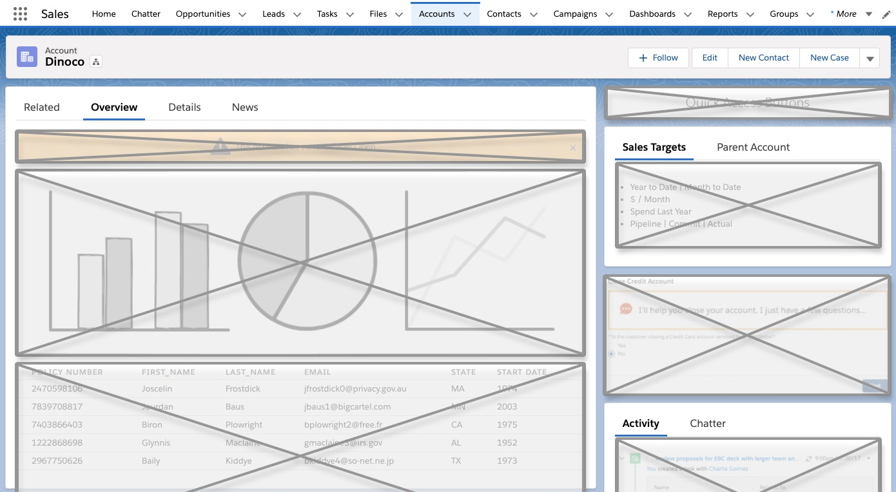
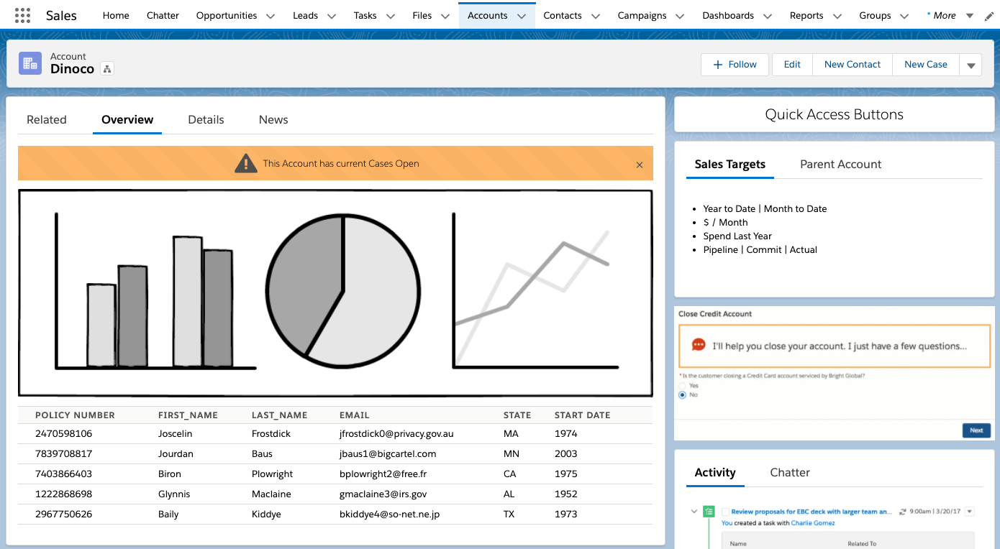
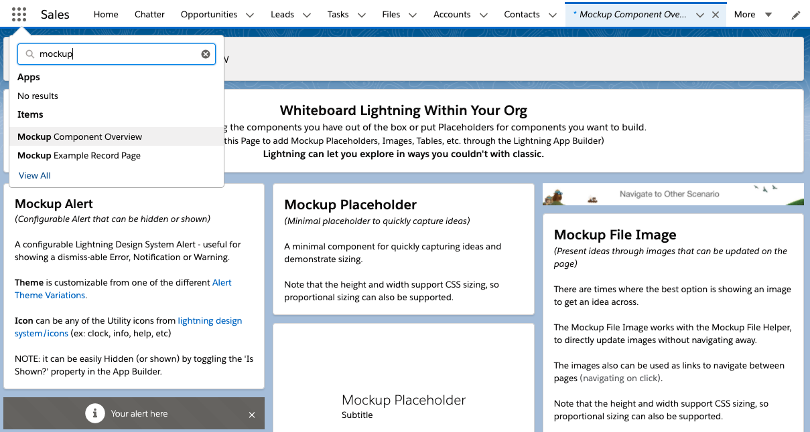
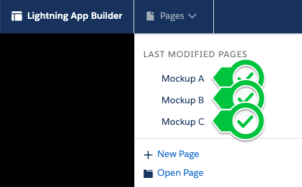
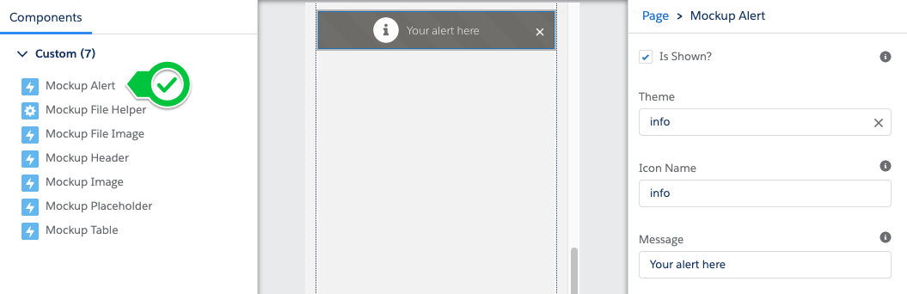
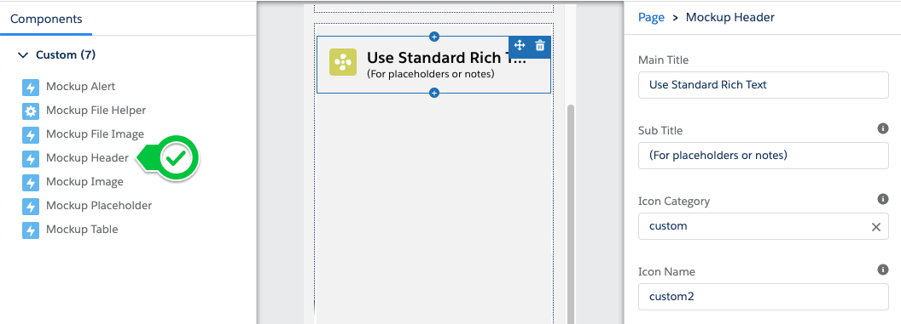
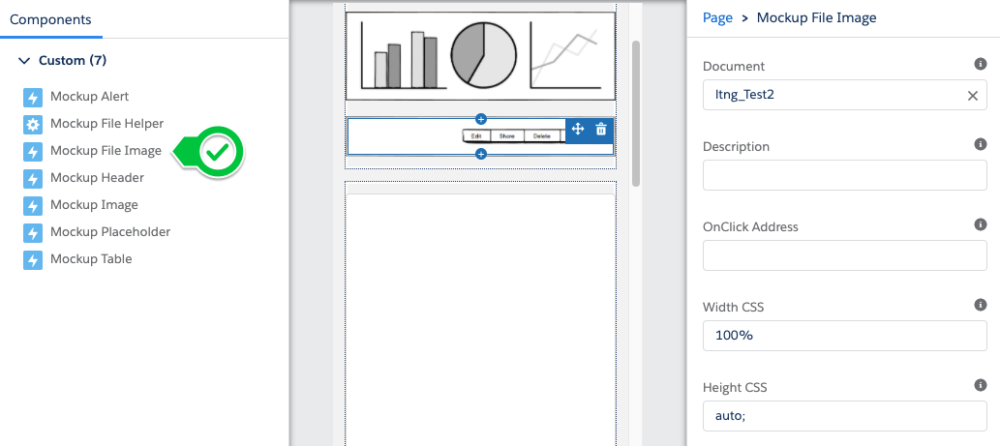
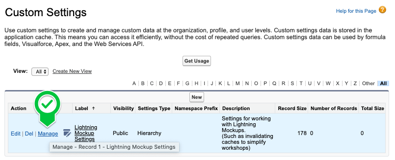

[](https://circleci.com/gh/CSGStrategicEngagements/ltng-support-mockup-components)
[](https://choosealicense.com/licenses/mit/)
[](https://circleci.com/gh/CSGStrategicEngagements/ltng-support-storybook)
[](https://circleci.com/gh/CSGStrategicEngagements/ltng-support-mockup-components)
[](https://circleci.com/gh/CSGStrategicEngagements/ltng-support-mockup-components)
[](https://circleci.com/gh/CSGStrategicEngagements/ltng-support-mockup-components)

# Overview

Please see the [Installation](#install) section below for more on how to install on your Sandbox / Demo org.

**Please note: sample code (metadata api and dx formats) are is also available in the [mdapi](./mdapi) and [dx](./dx) folders above**

---

```
This is a suite of components
that help you create 'Digital Paper Prototypes'
to help you and your customers quickly envision
what the Lightning Experience could be for them.
```

Whiteboarding is a common technique of structruing what we want to see and where. This is placing the building blocks so we can have meaningful discussions and make progress.

Sometimes, there can be difficulty in transitioning from Paper to their Salesforce Org.  The aim of this project is to help with that transition.

*  Explore what Standard Components you have available to you
*  Add in Mockups / Placeholders to brainstorm what you want
*  Create a compelling story to share with others
*  Perform A-B testing or "Digital Paper Prototypes" to get feedback

---
## For Example

During our Lightning Transition, we want to capture what a new Layout could look like - and what information it should show...

Utilizing these custom components alongside Standard Lightning Components lets us immediately show what is available and not - while demonstrating concepts and capturing information.



We can then mock that up in our favorite app: (like [Avonni Creator](https://www.avonni.app/products/avonni-creator), [Figma](https://www.figma.com/) using their [LDS Kit](https://www.figma.com/file/5dgFdCHB6FGjfOPAZEDNVK/Lightning-Design-System-Components-for-Web?node-id=0%3A1), [Framer](https://www.framer.com/) using their [LDS Kit](https://github.com/salesforce-ux/design-system-ui-kit-framerx), or [Balsamiq](https://balsamiq.com/wireframes/))

And then include within our layout (using the [Mockup Image component](#mockup-image-components) below),<br />
so we can get feedback right away.



---

# How to Use

## Using Components

The following are components that are available within the App Builder once installed.

While there are [Demo App Builder Pages using these components](#accessing-the-demo) - these are for demonstration purposes only and not needed to get up and running.

<table>
<tr>
	<th>Component</th><th>Description</th><th>When to Use</th>
</tr>
<tr>
	<td><a href='#mockup-alert'>Mockup Alert</a></td><td>A one-line Lightning Design System Alert</td><td>Useful for showing Errors / Notifications / Warnings.</td>
</tr>
<tr>
	<td><a href='#mockup-header'>Mockup Header</a></td><td>Lightning Design System Header</td><td>To clearly mark areas for discussion</td>
</tr>
<tr>
	<td><a href='#rich-text-standard'>Rich Text (Standard)</a></td><td><a href='https://help.salesforce.com/articleView?id=lightning_page_components.htm&type=5#rich_text_comp_defn'>The standard Rich Text component</a></td><td>Capturing detailed notes about an area or component.</td>
</tr>
<tr>
	<td><a href='#mockup-placeholder'>Mockup Placeholder</a></td><td>Intentionally minimal placeholder</td><td>When less is more / sizing is important. Especially helpful for presentations.</td>
</tr>
<tr>
	<td><a href='#mockup-table'>Mockup Table</a></td><td>Inline editable table</td><td>When multiple rows of information / responsive tables are needed.</td>
</tr>
</tr>
<tr>
	<td><a href='#mockup-file-image'>Mockup File Image</a></td><td>Images using Files</td><td>Iterating on images - thanks to the File Helper. Generally not recommended for presentations, as Mockup Images can load much faster.</td>
</tr>
<tr>
	<td><a href='#mockup-file-helper'>Mockup File Helper</a></td><td>Utility to quickly upload and edit File Images without leaving the page.</td><td>Iterating on images. Filtered / hidden during presentations.</td>
</tr>
<tr>
	<td><a href='#mockup-image'>Mockup Image</a></td><td>Image placement using Static Resources</td><td>Used for Presentations, as they load much faster than Mockup File Images</td>
</table>

## Accessing the Demo

Please note that a sample page with the components shown are provided in the package.

Assigning the `ltng_MockupDemoParticipant` permission set will grant you access to the `Mockup Component Overview Page` used in many of these demonstrations.



However, it is purely a demonstration and not required for use.


## Uploading from Mobile

An additional App Builder Page named 'File Helper' is also supplied.  If desired, this can be added to Mobile Navigation to give a one stop shop to upload images during a whiteboarding session.


## General

The goal of this project is to [leverage the power of the App Builder](https://trailhead.salesforce.com/en/content/learn/modules/lightning_app_builder/lightning_app_builder_intro) by using both Standard Components and the provided Mockup Components to discuss layouts or ideate on a better experience.

One can switch between Mockups within the App Builder, or even navigate between them using standard navigation / urls.



Note that because these mockups are directly WITHIN Salesforce, users can access the mockups using standard navigation. Standard App Builder features like [Component Visibility Filtering](https://help.salesforce.com/articleView?id=lightning_page_components_visibility.htm&type=5) and [Profile / App based Activation](https://help.salesforce.com/articleView?id=lightning_page_getting_into_salesforce1.htm&type=5) we can demonstrate real Salesforce functionality side by side with our Mockup work available only in specific situations. Even allowing for AB Walkthrough Testing.


## Specific Case - Exploring Layouts

One of the simplest scenarios is simply to ideate on how a more optimal Salesforce Layout would look (and behave).

Using Placeholders to identify content that is needed immediately (above the fold).

Using Rich Text to capture notes on what that we know about each of those sections.

Using simple Data Mocking services (like [Mockaroo](https://mockaroo.com)) and the [Mockup Table](#mockup-table) or Image Mocking apps (like [Balsamiq](https://balsamiq.com/wireframes/)) with [Mockup Image Components](#mockup-image-components) - we can quickly and easily sculpt outlines of a Layout.  

All while capturing information for further discussion / development, and within Salesforce for confidence in our approach.


## Specific Case - Iterating on a Component

Alternatively, we can focus on iterating a specific Component / functionality to develop.

Let’s explore adding a new component that we'll call: Button-Strip.

The next examples are different levels of fidelity as we move towards it:

### Make Placeholders

Capture what you know about them to keep the conversation going.


### Brainstorm with Drawings

Using Sticky-Notes or Whiteboards, brainstorm how it should look or behave.


Use [Mockup File Helper](#mockup-file-helper) and [Mockup File Image](#mockup-file-image) to upload images directly from your cell phone.

### Ideate with Developers using Playgrounds

Iterate with Developers to keep expectations grounded. If necessary, perform quick iterations using Salesforce Playgrounds or Component Docs to negotiate options or verify assumptions.


### Formalize with Wireframe Apps

Capture multiple versions or nail down the specifics.


Only the component needs to be mocked up, instead of the entire application leaving power in your hands to iterate.

### One by one, make the components real

Evaluate what you have out of the box.  Walk through options.

Then one by one, make them real.


# Components

The following are components that are available within the App Builder once installed.

While there are [Demo App Builder Pages using these components](#accessing-the-demo) - these are for demonstration purposes only and not needed to get up and running.

<table>
<tr>
	<th>Component</th><th>Description</th><th>When to Use</th>
</tr>
<tr>
	<td><a href='#mockup-alert'>Mockup Alert</a></td><td>A one-line Lightning Design System Alert</td><td>Useful for showing Errors / Notifications / Warnings.</td>
</tr>
<tr>
	<td><a href='#mockup-header'>Mockup Header</a></td><td>Lightning Design System Header</td><td>To clearly mark areas for discussion</td>
</tr>
<tr>
	<td><a href='#rich-text-standard'>Rich Text (Standard)</a></td><td><a href='https://help.salesforce.com/articleView?id=lightning_page_components.htm&type=5#rich_text_comp_defn'>The standard Rich Text component</a></td><td>Capturing detailed notes about an area or component.</td>
</tr>
<tr>
	<td><a href='#mockup-placeholder'>Mockup Placeholder</a></td><td>Intentionally minimal placeholder</td><td>When less is more / sizing is important. Especially helpful for presentations.</td>
</tr>
<tr>
	<td><a href='#mockup-table'>Mockup Table</a></td><td>Inline editable table</td><td>When multiple rows of information / responsive tables are needed.</td>
</tr>
</tr>
<tr>
	<td><a href='#mockup-file-image'>Mockup File Image</a></td><td>Images using Files</td><td>Iterating on images - thanks to the File Helper. Generally not recommended for presentations, as Mockup Images can load much faster.</td>
</tr>
<tr>
	<td><a href='#mockup-file-helper'>Mockup File Helper</a></td><td>Utility to quickly upload and edit File Images without leaving the page.</td><td>Iterating on images. Filtered / hidden during presentations.</td>
</tr>
<tr>
	<td><a href='#mockup-image'>Mockup Image</a></td><td>Image placement using Static Resources</td><td>Used for Presentations, as they load much faster than Mockup File Images</td>
</table>

## Mockup Alert

Useful for showing Errors / Notifications / Warnings.



#### App Builder Properties

<table>
<tr>
	<th>Name</th><th>Description</th><th>Examples</th>
</tr>
<tr>
	<td>Is Shown?</td><td>Whether the Alert should be shown - or not</td><td></td>
</tr>
<tr>
	<td>Theme</td><td>The <a href='https://lightningdesignsystem.com/components/alert/#Variations'>Alert Variation</a></td><td>info, warning, error, offline</td>
</tr>
<tr>
	<td>Icon Name</td><td>from <a href='https://www.lightningdesignsystem.com/icons'>lightningdesignsystem.com/icons</a></td><td>account, contact, custom1</td>
</tr>
<tr>
	<td>Message</td><td>Message to show within the Alert</td><td>This Account has Open Cases</td>
</tr>
</table>

## Mockup Header

A configurable Lightning Design System Page Header - useful for defining sections.



#### App Builder Properties

<table>
<tr>
	<th>Name</th><th>Description</th><th>Examples</th>
</tr>
<tr>
	<td>Title</td><td>Large Title of the spacer</td><td>List of Accounts</td>
</tr>
<tr>
	<td>Sub-Title</td><td>Smaller title (beneath the Title)</td><td>(Name, Organization, ...)</td>
</tr>
<tr>
	<td>Icon Category</td><td>Category from <a href='https://www.lightningdesignsystem.com/icons'>lightningdesignsystem.com/icons</a></td><td>standard, custom, utility, ...</td>
</tr>
<tr>
	<td>Icon Name</td><td>from <a href='https://www.lightningdesignsystem.com/icons'>lightningdesignsystem.com/icons</a></td><td>account, contact, custom1</td>
</tr>
</table>

## Rich Text (Standard)

One of the most important components with your Digital Paper Prototypes is the Standard Rich Text component.


Use this to capture Text information and notes.
(Which fields / types of information to show, etc)

#### How to use the Component

Drag the Component to your App Builder page and update the information in the Rich Text Editor.

Generally, this can be lists of what we know about this area / component.

Such as:

* Toggles / Buttons / Actions
* What information should be shown
  * Format of that information
* etc.

## Mockup Placeholder

Placeholders are for times we want to be quick, or sizing is important.


Note that this is quite a bit easier to specify the size than with the standard rich text component.

#### App Builder Properties

<table>
<tr>
	<th>Name</th><th>Description</th><th>Examples</th>
</tr>
<tr>
	<td>Title</td><td>Large Title of the spacer</td><td>List of Accounts</td>
</tr>
<tr>
	<td>Sub-Title</td><td>Smaller title (beneath the Title)</td><td>(Name, Organization, ...)</td>
</tr>
<tr>
	<td>Height</td><td>CSS Height. By default it automatically is in proportion to the width</td><td>`auto` or `200px`</td>
</tr>
<tr>
	<td>Width</td><td>CSS Width. By default - it automatically is full width</td><td>ex: `100%` or `200px`</td>
</tr>
</table>

## Mockup Table

Lightning Experience gives the ability to work with Salesforce from the Mobile Phone and from Desktop.

Tables tend to have quite a bit of data, and should not generally look the same on Phones as they should from Desktop.


Instead of cramming as much information together, sometimes a different approach is warranted.


The information is simply a CSV (comma separated value - text)

While it is possible to write your own, it can be simplest to either [use a data generation / mocking service to generate your data](#using-mocking-services) or to [Inline Edit - by double clicking](#to-update-tables).

When you are happy with the text, [Export to Clipboard and then paste in App Builder](#preserving-the-changes)

### What is CSV

This means that each cell simply has a comma between values, like:

```
Header A, Header B
Value 1A, Value 1B
Value 2A, Value 2B
```

Note that newlines are stripped in the App Builder (but not in inline editing), so include `\n` between lines:

```
Header A, Header B\n
Value 1A, Value 1B\n
Value 2A, Value 2B
```

**NOTE:** If the browser doesn't support separating by new lines
(by pressing the return key or pasting where the lines are separated already)
then please include `\n` (or `\r`) between lines.

### To Update Tables

Simply double-click the table (or press the Edit Button available on mouse over)

Then edit the csv information inline.


Once happy with the text, press the `apply` button to preview the changes.

**NOTE: Applying the value will not keep the change on next visit.**

When you are happy with the text, [Export to Clipboard and then paste in App Builder](#preserving-the-changes)

### Preserving the Changes

Inline-Editing tables is meant to be temporary, as a way to brainstorm.
(And to keep App Builder as the source of truth)

Once happy with the changes, open the 'Edit Mode' and then press the `Clipboard for App Builder` button.


This will place the text in your clipboard, so you can paste it in the App Builder for the table to directly save your changes. 


### Using Mocking Services

Sometimes it helps to have data to see how things might behave.

Using a Mocking Service (like [Mockaroo](https://mockaroo.com/) or [GenerateData.com](https://www.generatedata.com/)) we can easily mock up data we could see.


Then simply copy and paste the CSV into the table.


## Mockup Image Components

There can often be little substitute for Images to tell a story.

Sometimes we know what we want things to look like, but it isn't available in Lightning ... yet.


There are two components to show images:

<table>
	<tr>
		<th>Name</th><th>Description</th><th>When to use</th>
	</tr>
	<tr>
		<td>Mockup File Image</td><td>Use Files to show images</td><td>Allows for in-page editing without going through setup. However, slower to load</td>
	</tr>
	<tr>
		<td>Mockup Image</td><td>Uses static resources to show images</td><td>Static Resources load much faster. Use when closer to presentations</td>
	</tr>
</table>


## Mockup File Image

Use the Mockup File Image to help visualize a component in your org.



#### App Builder Properties

<table>
<tr>
	<th>Name</th><th>Description</th><th>Examples</th>
</tr>
<tr>
	<td>Document</td><td>Picklist of the Documents we could show</td><td></td>
</tr>
<tr>
	<td>Description</td><td>The Alt text shown for the image</td><td>Description for this image...</td>
</tr>
<tr>
	<td>OnClick Address</td><td>URL to navigate to on click. Another way to navigate between mocks.</td><td>/lightning/n/ltng_MockupExampleRecordPage</td>
</tr>
<tr>
	<td>Height CSS</td><td>CSS Height. By default it automatically is in proportion to the width</td><td>`auto` or `200px`</td>
</tr>
<tr>
	<td>Width CSS</td><td>CSS Width. By default - it automatically is full width</td><td>ex: `100%` or `200px`</td>
</tr>
</table>


**NOTE** - To reduce the number of static resources in the dropdown, please review the [Preferences option / Troubleshooting for Many Files and Static Resources](#many-files-and-static-resources)


## Mockup File Helper

This component can be added to your page, to let you create (or update files) without navigating away.


* Simply select the image file you would like to use
* Then either select which File to update
  * or simply type the name of the file to create.


Updating the file will immediately refresh those Mockup Images using that image.

**NOTE:** - if using [Preferences to limit the Static Resources](#many-files-and-static-resources), please note that the prefix will automatically be added to the file name.

Since the filter limits which resources are returned, this will ensure that images you upload will always be available for selection.

**Pro Tip:** - note you can also add on a [Component Visibility Filtering](https://help.salesforce.com/articleView?id=lightning_page_components_visibility.htm&type=5) so the File Helper will only be available to those that need to see it / and not for other participants.

It can also be helpful to use a hierarchical custom setting or user field to indicate that this user should not (or should be able to) see the File Helper.

#### App Builder Properties

<table>
<tr>
	<th>Name</th><th>Description</th><th>Examples</th>
</tr>
<tr>
	<td>Show Spacer?</td><td>Whether or not a space is added below. (This can be helpful so the dropdown does not extend below the bottom of the screen)</td><td></td>
</tr>
<tr>
	<td>Is Collapsible?</td><td>Whether the component is collapsible (to just the header) or not.</td><td></td>
</tr>
</table>


## Mockup Image

Once you are happy with your image, and are getting ready for the presentation, convert the files to Static Resources, and use the `Mockup Image` component.

**Step 1.** Within Setup, navigate to Static resources.

**Step 2.** Within the App Builder for the page, either select from the list of static resources available, or manually type the `Name` of the resource

Once you update the static resource, the image will be updated without making changes.


#### App Builder Properties

<table>
<tr>
	<th>Name</th><th>Description</th><th>Examples</th>
</tr>
<tr>
	<td>Resource name</td><td>Picklist of resource names. If `Manual...` is selected, then the Manual Name (below) is used</td><td></td>
</tr>
<tr>
	<td>Resource Name (Manual)</td><td>The name of the static resource to use (if known and Manual is selected above)</td><td>ltng_RecordHeader or ltng_ExamplePlaceholderImage</td>
</tr>
<tr>
	<td>Description</td><td>The Alt text shown for the image</td><td>Description for this image...</td>
</tr>
<tr>
	<td>OnClick Address</td><td>URL to navigate to on click. Another way to navigate between mocks.</td><td>/lightning/n/ltng_MockupExampleRecordPage</td>
</tr>
<tr>
	<td>Height CSS</td><td>CSS Height. By default it automatically is in proportion to the width</td><td>`auto` or `200px`</td>
</tr>
<tr>
	<td>Width CSS</td><td>CSS Width. By default - it automatically is full width</td><td>ex: `100%` or `200px`</td>
</tr>
</table>

---

# Troubleshooting

## Many Files and Static Resources 

Some orgs can have a large number of files and static resources.  This can make searching a bit tiresome.

Please create (or update) your [Mockup Preferences](#mockup-preferences) and set the `Mock Image Filter` so only files made with that filter name will be included in search results.  Also review the `Max Search Results` if the number of records returned can be reduced (default 100)

# Mockup Preferences

A custom setting is available to specify preferences how to work with Mockups.  This can be especially helpful for those orgs that have a large number of static resources / files - and searching can become tiresome.

To specify, create a new Custom Setting record. (Generally company wide, but can also be set at the User / Role levels)



<table>
<tr>
	<th>Name</td><td>Description</td><td>Example</td>
</tr>
<tr>
	<td>Enable Mock Caching</td><td>Allows caching of images (Mock Images - using Static Resources and Mock File Images - using Files) This allows the images to load even faster than normal, at the expense that the latest image may not be provided</td><td>(checked or unchecked)</td>
</tr>
<tr>
	<td>Max Search Results</td><td>This is the maximum number of results returned when searching.  Making this number larger can reduce performances of searches.</td><td>100</td>
</tr>
<tr>
	<td>Mock Image File Filter</td><td>Only Files / Static resources that (also) include this text will be included in results.  Files that are created automatically will include this (prefixed)</td><td>`mock` or `ltng_`</td>
</tr>
</table>

----

# Install

There are three methods available for you to install this demo, so you can play around with it:

(Please note, all are intended as demonstrations and are not intended for deployment to Production as is)

* [Install via URL](#install-via-url)
* [Install Demo via Salesforce CLI](#install-via-salesforce-cli)
* [Install Demo via Ant/Metadata API](#install-via-metadata-api)

## Install via URL

This works very similar to an App Exchange install.

Please login to an available sandbox and click the link below.

[https://test.salesforce.com/packaging/installPackage.apexp?p0=04t3s000003OonPAAS](https://test.salesforce.com/packaging/installPackage.apexp?p0=04t3s000003OonPAAS)

(or simply navigate to `https://YOUR_SALESFORCE_INSTANCE/packaging/installPackage.apexp?p0=04t3s000003OonPAAS` <br />
if you are already logged in)


It is recommended to install for Admins Only (but all options will work)

##### Run the Demos

Thats it. See the [How to Use](#how-to-use) section for how to use the app.

## Installing via the Salesforce CLI

This assumes you have already installed the [Salesforce CLI]() and [Connected the Salesforce CLI to your org](https://developer.salesforce.com/docs/atlas.en-us.sfdx_dev.meta/sfdx_dev/sfdx_dev_auth_web_flow.htm).

However, the Salesforce CLI can be used with any org and does not require Salesforce DX to be enabled. (Although enabling the DX / Dev Hub would give some great benefits, and would only require care of [certain object permissions: Scratch Org Info, ActiveScratchOrg, NamespaceRegistry](https://developer.salesforce.com/docs/atlas.en-us.sfdx_setup.meta/sfdx_setup/sfdx_setup_add_users.htm) - as they are not available in all orgs)

#### Installing via Source

	sfdx force:source:deploy -u [[orgAlias]]

#### Installing via package

    sfdx force:package:install -w 10 --package 04t3s000003OonPAAS -u [[orgAlias]]
    
### Assigning Permission Set

Please note that a sample page with the components shown are provided in the package.

Assigning the `ltng_MockupDemoParticipant` permission set will grant you access to the `Mockup Component Overview Page` used in many of these demonstrations.


However, it is purely a demonstration and not required for use.

To assign, run the following command:

    sfdx force:user:permset:assign -n ltng_MockupDemoParticipant -u [[orgAlias]]

##### Run the Demos

Thats it. See the [How to Use](#how-to-use) section for how to use the app.

	sfdx force:org:open -u [[orgAlias]]
	
# Licensing

Copyright 2020 Salesforce

(MIT)

Permission is hereby granted, free of charge, to any person obtaining a copy of this software and associated documentation files (the "Software"), to deal in the Software without restriction, including without limitation the rights to use, copy, modify, merge, publish, distribute, sublicense, and/or sell copies of the Software, and to permit persons to whom the Software is furnished to do so, subject to the following conditions:

The above copyright notice and this permission notice shall be included in all copies or substantial portions of the Software.

THE SOFTWARE IS PROVIDED "AS IS", WITHOUT WARRANTY OF ANY KIND, EXPRESS OR IMPLIED, INCLUDING BUT NOT LIMITED TO THE WARRANTIES OF MERCHANTABILITY, FITNESS FOR A PARTICULAR PURPOSE AND NONINFRINGEMENT. IN NO EVENT SHALL THE AUTHORS OR COPYRIGHT HOLDERS BE LIABLE FOR ANY CLAIM, DAMAGES OR OTHER LIABILITY, WHETHER IN AN ACTION OF CONTRACT, TORT OR OTHERWISE, ARISING FROM, OUT OF OR IN CONNECTION WITH THE SOFTWARE OR THE USE OR OTHER DEALINGS IN THE SOFTWARE.0
