[](https://circleci.com/gh/SalesforceCloudServices/ltng-support-mockup-components)
[](https://choosealicense.com/licenses/mit/)
[](https://circleci.com/gh/SalesforceCloudServices/ltng-support-storybook)
[](https://circleci.com/gh/SalesforceCloudServices/ltng-support-mockup-components)
[](https://circleci.com/gh/SalesforceCloudServices/ltng-support-mockup-components)
[](https://circleci.com/gh/SalesforceCloudServices/ltng-support-mockup-components)

# Overview

Please see the [Installation](#install) section below for more on how to install on your Sandbox / Demo org.

**Please note: sample code (metadata api and dx formats) are is also available in the [mdapi](./mdapi) and [dx](./dx) folders above**

---

```
This is a suite of components
that help you create 'Digital Paper Prototypes'
to help you and your customers quickly envision
what the Lightning Experience could be for them.
```

Whiteboarding is a common technique of structruing what we want to see and where. This is placing the building blocks so we can have meaningful discussions and make progress.

Sometimes, there can be difficulty in transitioning from Paper to their Salesforce Org.  The aim of this project is to help with that transition.

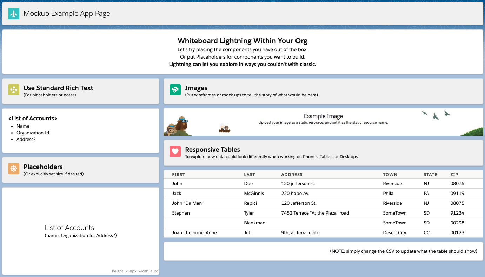

*  Explore what Standard Components you have available to you
*  Add in Mockups / Placeholders to brainstorm what you want
*  Create a compelling story to share with others
*  Perform A-B testing or "Digital Paper Prototypes" to get feedback

---
## For Example

We might discover a new component to show the current sales numbers during our wireframe session...

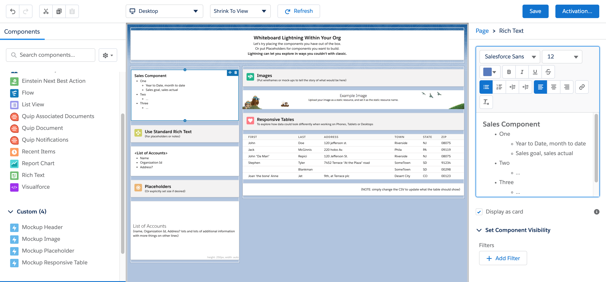

We can then mock that up in our favorite app: (like [Avonni Creator](https://www.avonni.app/products/avonni-creator), [Figma](https://www.figma.com/) using their [LDS Kit](https://www.figma.com/file/5dgFdCHB6FGjfOPAZEDNVK/Lightning-Design-System-Components-for-Web?node-id=0%3A1), [Framer](https://www.framer.com/) using their [LDS Kit](https://github.com/salesforce-ux/design-system-ui-kit-framerx), or [Balsamiq](https://balsamiq.com/wireframes/))

And then include within our layout (using the [Mockup Image component](https://github.com/SalesforceCloudServices/ltng-support-mockup-components#mockup-image) below),<br />
so we can get feedback right away.

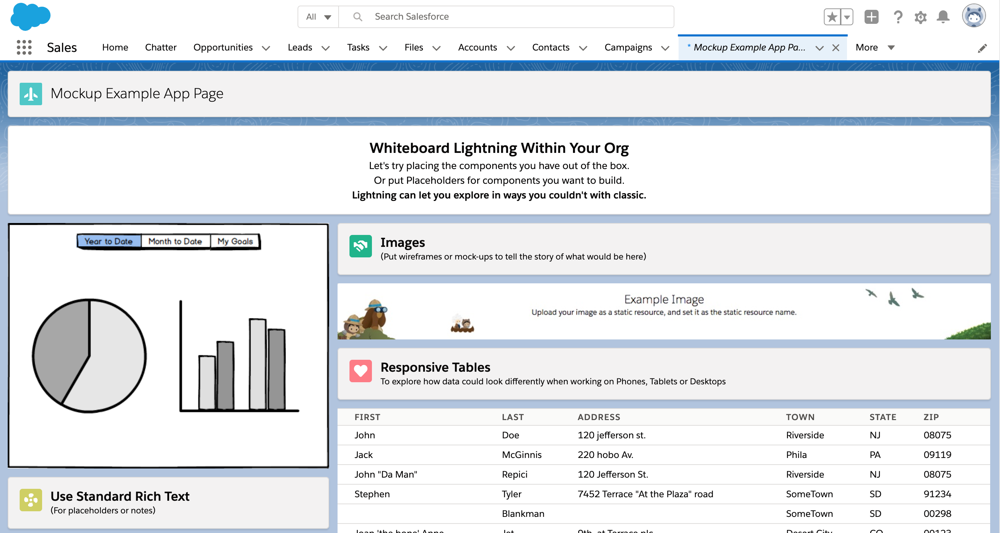

Using App Builder filters based on permissions, then only authorized people will see it within our A/B tests.
It also gives power to the Administrators, so they can ‘play’ without needing to request new wires.

Then one by one, replace your Mockups to make it real.

---

NOTE: This project is for demonstration purposes.
For more information, please see the [Licensing](#licensing) section below

# How to Use


[Create pages within the App Builder](https://trailhead.salesforce.com/en/content/learn/modules/lightning_app_builder/lightning_app_builder_intro) and use the standard components and the provided Mockup Components below...

The goal is to be as iterative as possible while keeping the conversation going.

Generally, the recommended flow is similar to the following:

## Make Placeholders

Capture what you know about them to keep the conversation going.

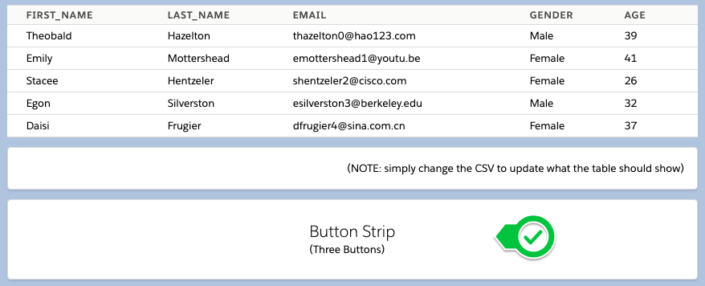

## Brainstorm with Drawings

Using Sticky-Notes or Whiteboards, brainstorm how it should look or behave.

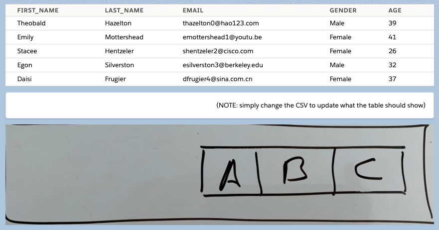

Use [Mockup File Helper](#file-helper) and [Mockup File Image](#mockup-file-image) to upload images directly from your cell phone.

## Formalize with Wireframe Apps

Capture multiple versions or nail down the specifics.

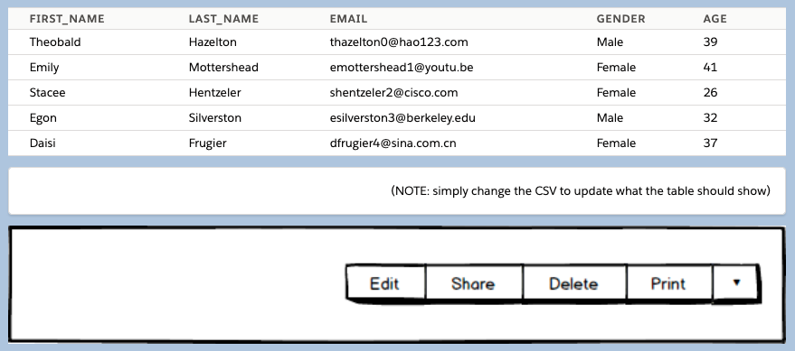

Only the component needs to be mocked up, instead of the entire application leaving power in your hands to iterate.

## One by one, make the components real

Evaluate what you have out of the box.  Walk through options.

Then one by one, make them real.

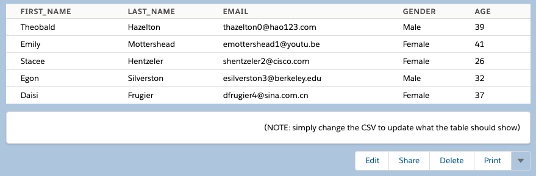

# Components

## Rich Text (Standard)

One of the most important components with your Digital Paper Prototypes is the Standard Rich Text component.

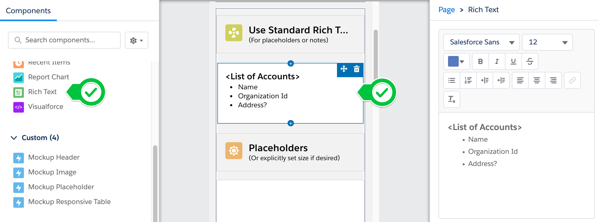

Use this to capture Text information and notes.
(Which fields / types of information to show, etc)

## Placeholders

Placeholders are for times we want to be quick, or sizing is important.

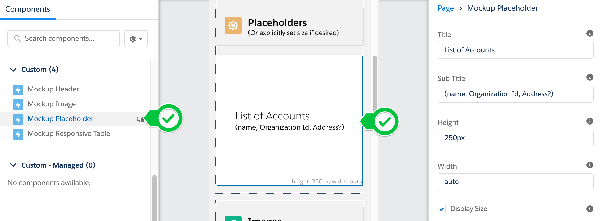

Note that this is quite a bit easier size than it would be on a rich text.

## Mockup Images

There can often be little substitute for Images to tell a story.

Sometimes we know what we want things to look like, but it isn't available in Lightning ... yet.

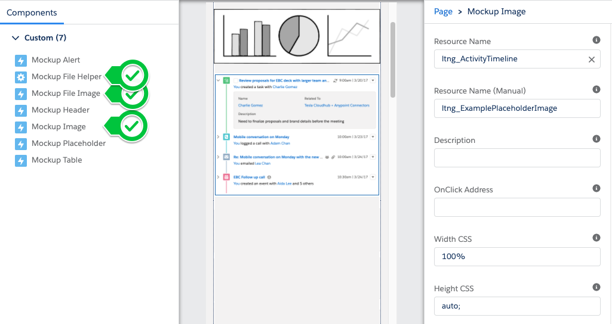


There are two components to show images:

<table>
	<tr>
		<th>Name</th><th>Description</th><th>When to use</th>
	</tr>
	<tr>
		<td>Mockup File Image</td><td>Use Files to show images</td><td>Allows for in-page editing without going through setup. However, slower to load</td>
	</tr>
	<tr>
		<td>Mockup Image</td><td>Uses static resources to show images</td><td>Static Resources load much faster. Use when closer to presentations</td>
	</tr>
</table>

## Mockup File Image

Use the Mockup File Image to help visualize a component in your org.

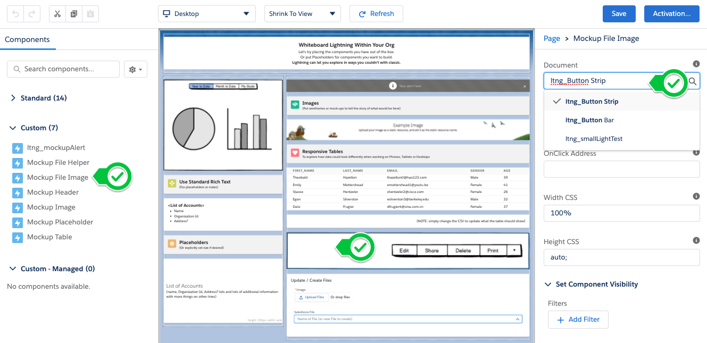

## Mockup File Helper

This component can be added to your page, to let you create (or update files) without navigating away.

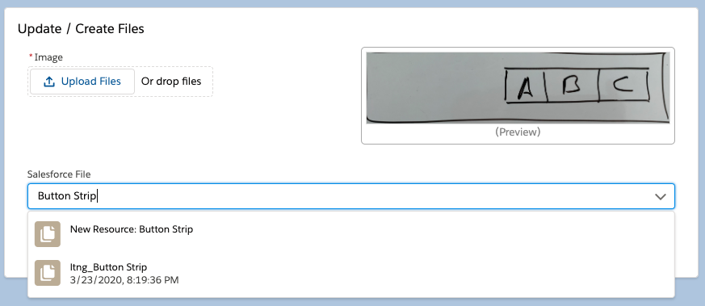

* Simply select the image file you would like to use
* Then either select which File to update
  * or simply type the name of the file to create.


Updating the file will immediately refresh those Mockup Images using that image.


## Mockup Image

Once you are happy with your image, and are getting ready for the presentation, convert the files to Static Resources, and use the `Mockup Image` component.

**Step 1.** Within Setup, navigate to Static resources.

**Step 2.** Within the App Builder for the page, either select from the list of static resources available, or manually type the `Name` of the resource

Once you update the static resource, the image will be updated without making changes.

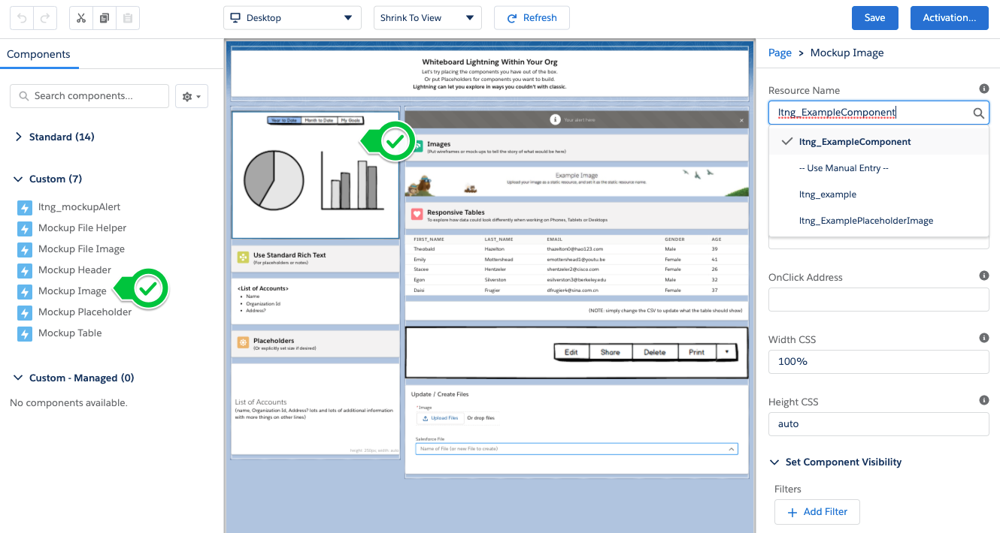


## Responsive Table

Lightning Experience gives the ability to work with Salesforce from the Mobile Phone and from Desktop.

Tables tend to have quite a bit of data, and should not generally look the same on Phones as they should from Desktop.

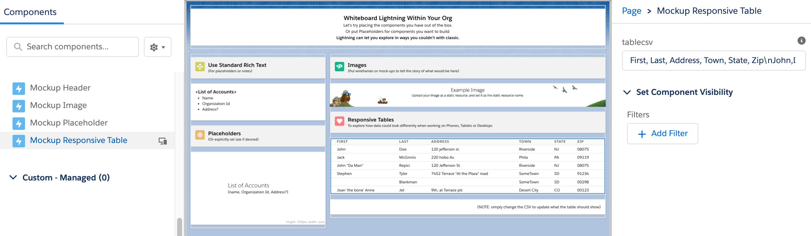

Instead of cramming as much information together, sometimes a different approach is warranted.

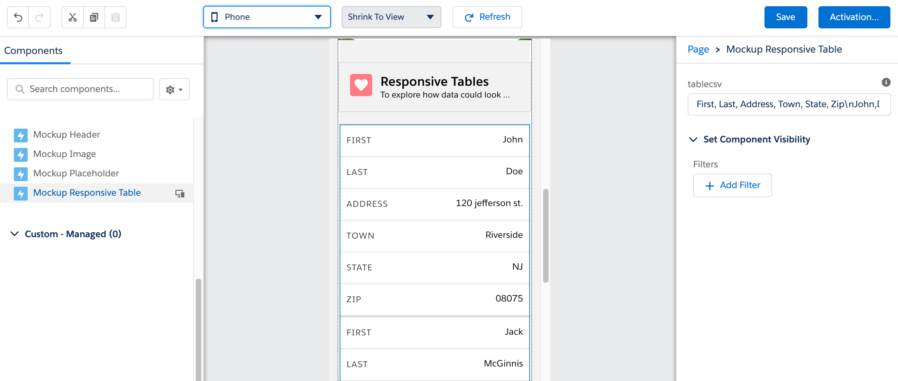

The information is simply a CSV (comma separated value - text)

Simply separate cells (values) with commas,
Optionally wrap cells within quotes - if there are commas,
and separate each line by pressing return.

**NOTE:** If the browser doesn't support separating by new lines
(by pressing the return key or pasting where the lines are separated already)
then please include `\n` (or `\r`) between lines.

### To Update Tables

Simply double-click the table (or press the Edit Button available on mouse over)

Then edit the csv information inline.

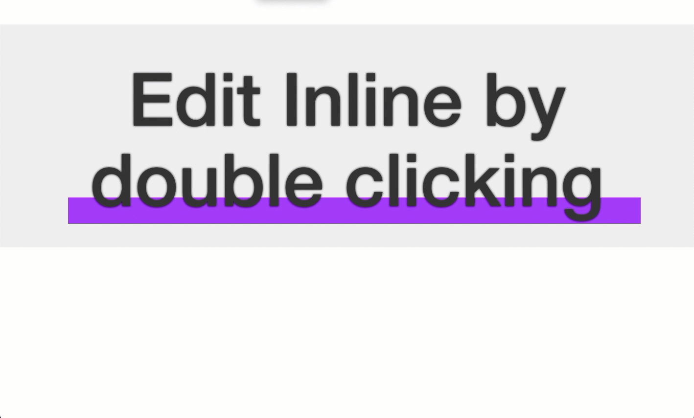

Once happy with the text, press the `apply` button to preview the changes.

### Preserving the Changes

Inline-Editing tables is meant to be temporary, as a way to brainstorm.
(And to keep App Builder as the source of truth)

Once happy with the changes, open the 'Edit Mode' and then press the `Clipboard for App Builder` button.

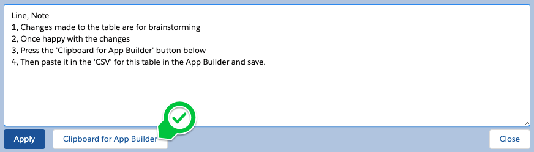

This will place the text in your clipboard, so you can paste it in the App Builder for the table to directly save your changes. 


### Using Mocking Services

Sometimes it helps to have data to see how things might behave.

Using a Mocking Service (like [Mockaroo](https://mockaroo.com/) or [GenerateData.com](https://www.generatedata.com/)) we can easily mock up data we could see.

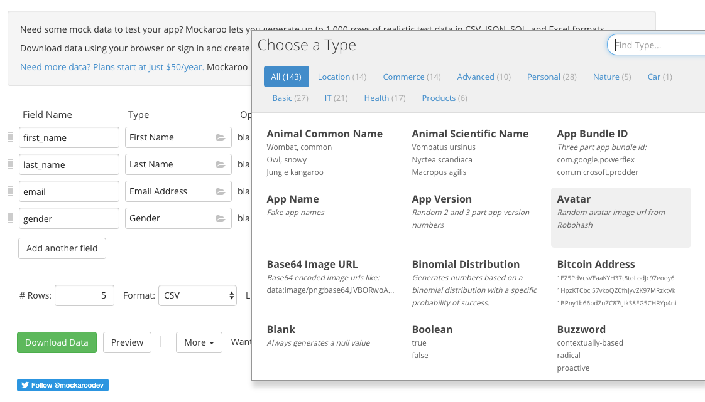

Then simply copy and paste the CSV into the table.


---

# Install

There are three methods available for you to install this demo, so you can play around with it:

(Please note, all are intended as demonstrations and are not intended for deployment to Production as is)

* [Install via URL](#install-via-url)
* [Install Demo via Salesforce CLI](#install-via-salesforce-cli)
* [Install Demo via Ant/Metadata API](#install-via-metadata-api)

## Install via URL

This works very similar to an App Exchange install.

Please login to an available sandbox and click the link below.

[https://test.salesforce.com/packaging/installPackage.apexp?p0=04t3s000003OodwAAC](https://test.salesforce.com/packaging/installPackage.apexp?p0=04t3s000003OodwAAC)

(or simply navigate to `https://YOUR_SALESFORCE_INSTANCE/packaging/installPackage.apexp?p0=04t3s000003OodwAAC` <br />
if you are already logged in)

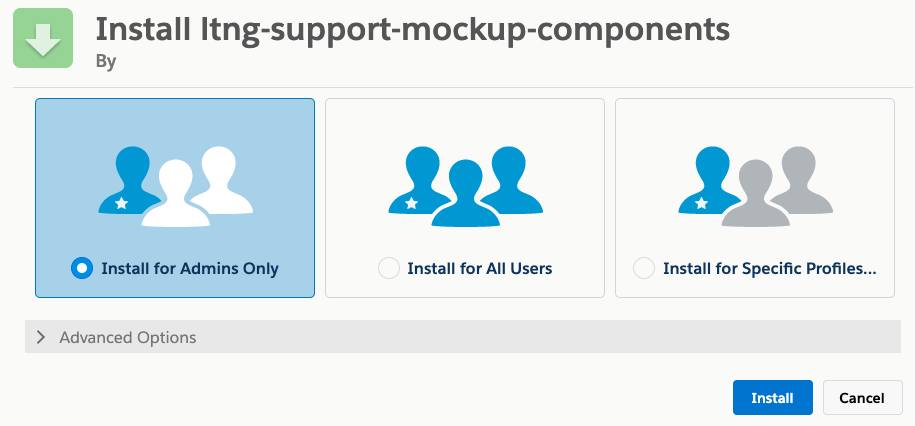

It is recommended to install for Admins Only (but all options will work)

##### Run the Demos

Thats it. See the [How to Use](#how-to-use) section for how to use the app.

## Installing via the Salesforce CLI

This assumes you have already installed the [Salesforce CLI]() and [Connected the Salesforce CLI to your org](https://developer.salesforce.com/docs/atlas.en-us.sfdx_dev.meta/sfdx_dev/sfdx_dev_auth_web_flow.htm).

However, the Salesforce CLI can be used with any org and does not require Salesforce DX to be enabled. (Although enabling the DX / Dev Hub would give some great benefits, and would only require care of [certain object permissions: Scratch Org Info, ActiveScratchOrg, NamespaceRegistry](https://developer.salesforce.com/docs/atlas.en-us.sfdx_setup.meta/sfdx_setup/sfdx_setup_add_users.htm) - as they are not available in all orgs)

**1.** Run the following command:

	sfdx force:mdapi:deploy -d mdapi -u [[orgAlias]] -w
	

##### Run the Demos

Thats it. See the [How to Use](#how-to-use) section for how to use the app.

	sfdx force:org:open -u [[orgAlias]]
	
# Licensing

Copyright 2020 Salesforce

(MIT)

Permission is hereby granted, free of charge, to any person obtaining a copy of this software and associated documentation files (the "Software"), to deal in the Software without restriction, including without limitation the rights to use, copy, modify, merge, publish, distribute, sublicense, and/or sell copies of the Software, and to permit persons to whom the Software is furnished to do so, subject to the following conditions:

The above copyright notice and this permission notice shall be included in all copies or substantial portions of the Software.

THE SOFTWARE IS PROVIDED "AS IS", WITHOUT WARRANTY OF ANY KIND, EXPRESS OR IMPLIED, INCLUDING BUT NOT LIMITED TO THE WARRANTIES OF MERCHANTABILITY, FITNESS FOR A PARTICULAR PURPOSE AND NONINFRINGEMENT. IN NO EVENT SHALL THE AUTHORS OR COPYRIGHT HOLDERS BE LIABLE FOR ANY CLAIM, DAMAGES OR OTHER LIABILITY, WHETHER IN AN ACTION OF CONTRACT, TORT OR OTHERWISE, ARISING FROM, OUT OF OR IN CONNECTION WITH THE SOFTWARE OR THE USE OR OTHER DEALINGS IN THE SOFTWARE.